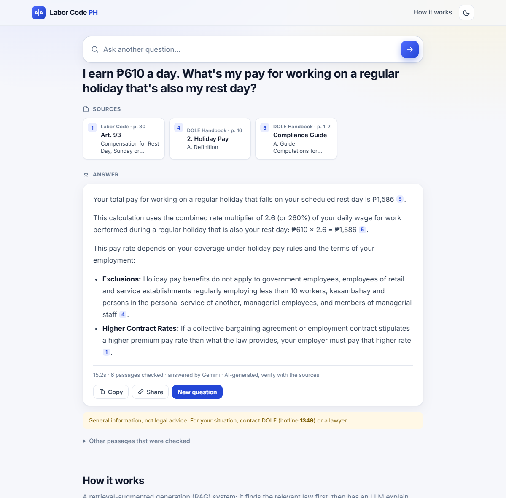
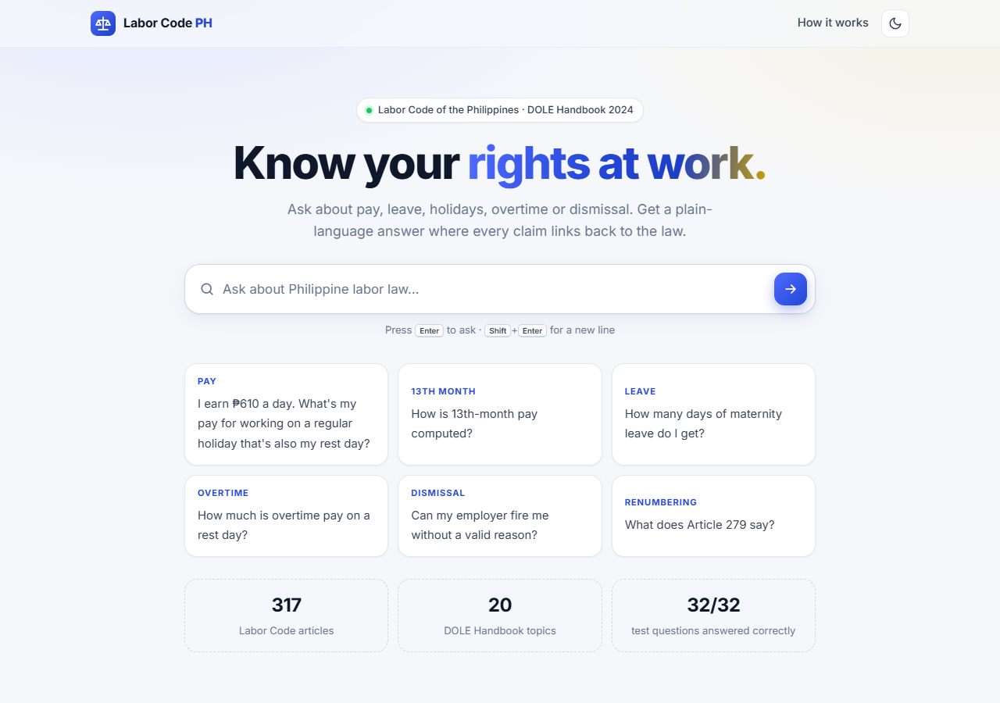
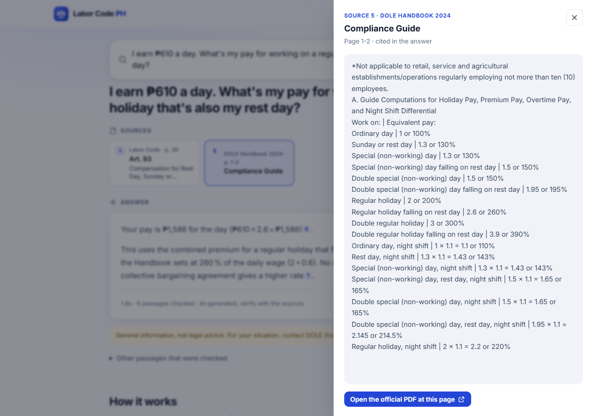
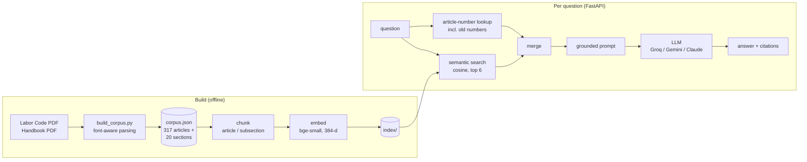

# Labor Code PH

Ask questions about Philippine labor law in plain language, and get answers
grounded in the **Labor Code of the Philippines** and **DOLE's Handbook on
Workers' Statutory Monetary Benefits**, with a citation for every claim and a
link that opens the source PDF at the right page.

It's a retrieval-augmented generation (RAG) system built from the ground up:
PDF parsing, chunking, vector search, prompting and evaluation are all
hand-written. No LangChain and no vector database. It's measured against the
same LLM answering without retrieval.



| Landing page | Click a citation to read the source |
|---|---|
|  |  |

## Results

Same LLM (`openai/gpt-oss-120b` on Groq), same test questions, with and
without retrieval ([details](#evaluation)):

| | This app (RAG) | LLM alone |
|---|---|---|
| Correct answers | **32/32** | 26/29 |
| Cited a **wrong** Labor Code article | **0** | 8 |
| Cited an **outdated** (pre-2015) article number | **0** | 4 |
| Named the right article (10 article-only questions) | **10/10** | 5/10 |
| Right passage retrieved in the top 6 | **30/30** (MRR 0.909) | n/a |

The plain model usually knows the *numbers* (most rates and day counts are
right), but it cites the law badly. It named Art. 85 (meal periods) for
overtime, Art. 86 (night shift) for rest-day pay, and quoted an "Article 92"
that says no such thing. It also still uses pre-2015 numbering: Art. 281 for
probation, now Art. 296. For someone relying on the answer, a confident but
wrong citation is the dangerous failure, and it's the one retrieval removes.

Some of its outright errors: holiday pay at "130%" (it's 200%); a casual
employee becomes regular after "six months" (it's one year); service charges
shared "proportionally" (RA 11360: completely and equally).

## What it does

- **Answers in plain language, cited.** Every claim links to its passage;
  sources open the official PDF at the right page.
- **Knows the renumbering.** The Labor Code was renumbered in 2015, and many
  people (and chatbots) still use the old numbers. Asking about "Article 279"
  finds both today's Art. 279 and **Art. 294 (formerly 279), Security of Tenure**.
- **Uses DOLE's official pay multipliers.** Pay questions are answered with the
  Handbook's rate table (e.g. 260% for a regular holiday on a rest day).
- **Stays up on free tiers.** If a free LLM quota runs out, the app falls back
  to the next option (Groq's gpt-oss-120b → Groq's gpt-oss-20b, which has a
  separate quota → Gemini → Claude) and shows which one answered. The eval
  measures gpt-oss-120b only.
- **Says when it doesn't know.** Off-topic or vague questions ("what can I do
  with this?", "tell me a joke") are stopped by a relevance threshold before
  any LLM call, and the user gets the list of topics it can answer. If the
  passages are on topic but don't hold the answer, the LLM says so instead of
  guessing. Current minimum wages are a good test: the Handbook links to the
  regional wage boards instead of listing rates, so the app says it couldn't
  find them rather than inventing a figure.

## How it works



| Step | What happens | Code |
|---|---|---|
| Parse | PDFs → one record per article (with its footnotes) and per Handbook topic | [labor_rag/extract.py](labor_rag/extract.py) |
| Chunk | One chunk per article; Handbook split at subsections, ~220 words, paragraphs and table rows never cut | [labor_rag/chunk.py](labor_rag/chunk.py) |
| Embed | `BAAI/bge-small-en-v1.5` via fastembed (ONNX, CPU, no API key) with the citation label and Book/Title/Chapter path prepended | [labor_rag/embed.py](labor_rag/embed.py) |
| Store | NumPy matrix + JSON metadata; brute-force cosine search (~700 vectors takes about a millisecond) | [labor_rag/store.py](labor_rag/store.py), [labor_rag/similarity.py](labor_rag/similarity.py) |
| Retrieve | Semantic top-6, merged with direct article lookups ("Art. 94", old numbers too) | [labor_rag/retrieve.py](labor_rag/retrieve.py) |
| Generate | Answer only from numbered passages, cite them, refuse when they don't answer | [labor_rag/generate.py](labor_rag/generate.py) |
| Serve | FastAPI JSON API + a single-page UI; per-client rate limit protects the free LLM quota | [app/](app/) |

## The hard part: clean text from legal PDFs

Plain PDF-to-text extraction produced text that looked fine but was quietly
wrong in places a legal assistant can't afford. The parser works from
PyMuPDF's font metadata instead:

- **Footnote markers.** `ART. 94. Right to Holiday Pay.78 –` has a superscript
  footnote marker glued to the title. Superscript spans are dropped from the
  text, but the number is kept to **attach the footnote to its article**. That
  matters: the list of regular holidays lives in Art. 94's footnotes, and the
  note that RA 11210 extended maternity leave to 105 days lives in Art. 131's.
- **Footnotes mid-sentence.** Footnotes sit at the bottom of every page, so
  plain text splices them into the middle of articles. Rows in the small
  footnote font are moved out of the body text.
- **A scrambled pay-rate table.** In the Handbook's rate table, labels that
  wrap onto two lines shifted every value after them, so "Regular holiday"
  lost its 200% and rates landed on the wrong rows. Rows are rebuilt from x/y
  positions, wrapped labels are merged back, and the result was checked
  against the rendered page. A regression test pins it:
  `Regular holiday falling on rest day | 2.6 or 260%`.
- **Structure.** Book/Title/Chapter headings (by font size) give every
  article its path; the Handbook's bold subheadings ("A. Definition",
  "B. Coverage") become chunk boundaries and labels.

## Evaluation

**Test set** ([eval/questions.json](eval/questions.json)): 32 questions. 30
are answerable, each with the source that holds the answer (e.g. `art:297`,
`hb:13`) and the facts a correct answer must contain; 2 are out of scope
(business registration, passports), where the right answer is "I couldn't
find this".

**Metrics**
- **Retrieval hit@6 / MRR**: a hit needs a retrieved passage from the right
  source that *also contains the answer*. Being from the right document isn't
  enough when a Handbook section spans several pages.
- **Answer correctness**: the answer contains the expected facts (with
  accepted alternatives, e.g. "200%" / "twice").
- **Failure type**: every wrong RAG answer is labelled **retrieval** (the
  answer never reached the prompt) or **generation** (it was in the prompt;
  the model missed it). They need different fixes.
- **Article citations**: does the answer name the right article by its
  current number, an outdated one, a wrong one, or none?

**Baseline**: the same model with no retrieval, asked to cite the articles it
relies on. The NCR minimum-wage question is excluded from the comparison (its
figure can't be checked against the sources), as are the 2 out-of-scope ones.

**Grading honestly.** Every flagged answer was read, not just counted. Six
"failures" (three per system) turned out to be the grader being too literal:
"125 %" with a thin space, "30 percent" vs "30%", "reinstated" vs
"reinstatement", "60 days" vs "two months". Those fixes were applied to
**both** systems, and pinned by regression tests.
[eval/regrade.py](eval/regrade.py) re-scores saved answers without calling
the LLM and prints every verdict that changes. All answers from the final run
are in [eval/last_run.json](eval/last_run.json).

**Relevance threshold** ([eval/scope_check.py](eval/scope_check.py)).
Retrieval always returns its top 6, even for "tell me a joke", and a vague
question like "what can I do with this?" once came back as a confident answer
about VAWC leave. So questions whose best passage scores below a cosine
similarity of 0.62 are declined without calling the LLM. The threshold was
picked from data: the best-passage scores of 45 on-topic questions (the eval
set plus casual phrasings like "can I be fired?") against 20 off-topic or vague
ones ([eval/scope_questions.json](eval/scope_questions.json)):

| Threshold | On-topic declined | Off-topic stopped before the LLM |
|---|---|---|
| 0.60 | 0/45 | 17/20 |
| **0.62** | **0/45** | **18/20** |
| 0.64 | 0/45 | 19/20 |

The groups overlap: the lowest on-topic score is 0.666 ("can I be fired?"),
while "How do I apply for a Philippine passport?" scores 0.683. So the
threshold keeps a margin below every real question, and the two off-topic
questions that pass reach the LLM, which declines them. The gate doesn't
change any eval result: every eval question scores at least 0.728.

**What the eval caught, and the fixes**

| Problem found | Type | Fix | Result |
|---|---|---|---|
| "Regular holiday on a rest day" rate not retrieved: its chunk mixed a checklist table with the rate table | Retrieval | Every Handbook subsection starts a new chunk | hit@6 97% → 100%, MRR 0.864 → 0.909 |
| Asked about "Article 279", the model refused, though Art. 294 (formerly 279) was retrieved | Generation | Code detects ambiguous article numbers and states both meanings in the prompt | Answers cover today's Art. 279 *and* the old one |
| Pay-rate table values landed on the wrong rows | Data | Rows rebuilt from x/y positions | Checked against the page image; regression test |
| Merged table headers mislabelled which establishments are exempt | Data | Header cells filled from the left; duplicated sub-headers dropped | Header matches the printed table |
| A vague question ("what can I do with this?") got a confident answer about VAWC leave | Retrieval | Relevance threshold before the LLM, calibrated on 65 questions | 0/45 on-topic declined, 18/20 off-topic stopped |

**Caveats**: 32 questions is a small set; each system was run once (LLM
output varies between runs); keyword grading is simpler than an LLM judge.
The baseline answers come from one run and were re-graded, not regenerated,
after the grader fixes. The last prompt change (stating ambiguous article
numbers explicitly) came after the final full run. It only affects questions
that name an ambiguous article number (1 of the 32), and that answer was
checked by hand.

## Run it locally

```bash
python -m venv .venv
.venv/Scripts/activate            # macOS/Linux: source .venv/bin/activate
pip install -r requirements-dev.txt
cp .env.example .env              # add GROQ_API_KEY (free tier) or another provider's key

uvicorn app.main:app              # http://localhost:8000 (first run downloads the ~130 MB embedding model)
python ask.py "How much is holiday pay?" --show-context   # or use the CLI
pytest                            # offline tests: no model download, no LLM calls
```

The corpus and index are committed, so the app runs without the PDFs. To
rebuild from the sources, download them (see [sources/README.md](sources/README.md)), then:

```bash
python build_corpus.py            # PDFs -> data/corpus.json
python ingest.py                  # corpus -> chunks -> vectors -> index/
python eval/run_eval.py           # retrieval eval; add --generate --baseline for answers
```

## Deploy

It's one Docker container: FastAPI serves both the API and the page. The
image bakes in the embedding model, so a cold start downloads nothing, and it
runs in roughly 250 MB of RAM. It listens on `$PORT` (default 7860). The only
secret is `GROQ_API_KEY` (or another provider's key).

| Option | Cost | Sleeps when idle? | Notes |
|---|---|---|---|
| [Render](https://render.com) | Free | Yes, after 15 min (about a minute to wake) | Connect the GitHub repo; [render.yaml](render.yaml) is ready |
| [Hugging Face Spaces](https://huggingface.co/spaces) | Free, no card | After 48 h without visits | Docker Space; well known in data science |
| [Railway](https://railway.com) | Trial credit, then usage-based | No | Detects the Dockerfile automatically |
| [Google Cloud Run](https://cloud.run) | Free tier, needs billing | Scales to zero (a few seconds to start) | `gcloud run deploy --source .` |

**Render**: push to GitHub → Render dashboard → New → Blueprint → pick the
repo → set `GROQ_API_KEY` → Deploy.

**Hugging Face Spaces**: create a Space with the **Docker** SDK, add
`GROQ_API_KEY` under Settings → Secrets, then push this repo to the Space.
The Space's README needs this header, because Spaces read their config from it:

```yaml
---
title: Labor Code PH
emoji: ⚖️
colorFrom: blue
colorTo: indigo
sdk: docker
app_port: 7860
---
```

**Locally with Docker**:

```bash
docker build -t labor-code-ph .
docker run -p 7860:7860 -e GROQ_API_KEY=your_key labor-code-ph   # http://localhost:7860
```

## Limitations and next steps

- **General information, not legal advice.** The sources are the DOLE 2022
  edition of the Labor Code and the 2024 Handbook; later laws and wage orders
  aren't included.
- **No wage tables.** Regional minimum wages change often and the Handbook
  only links to them, so the app can't quote them. A next step is pointing
  users to the right NWPC page when it declines.
- **Next:** a short profile (region, job type, salary) to filter retrieval and
  personalise answers; pay calculators so code, not the LLM, does the
  arithmetic; questions in Taglish; LLM-as-judge grading to replace keyword
  checks.

## Sources

- *Labor Code of the Philippines*, DOLE 2022 edition, renumbered pursuant to
  Department Advisory No. 01, s. 2015 ([ILO NATLEX copy](https://natlex.ilo.org/dyn/natlex2/natlex2/files/download/15242/PHL15242%202022.pdf)).
- *Handbook on Workers' Statutory Monetary Benefits*, DOLE Bureau of Working
  Conditions, 2024 edition ([NWPC copy](https://nwpc.dole.gov.ph/wp-content/uploads/2024/11/Workers-Statutory-Monetary-Benefits-Handbook-2024-Edition.pdf)).

Both are free DOLE publications. This project isn't affiliated with DOLE.

## License

Code: [MIT](LICENSE). The source documents are DOLE publications; see [sources/README.md](sources/README.md).
